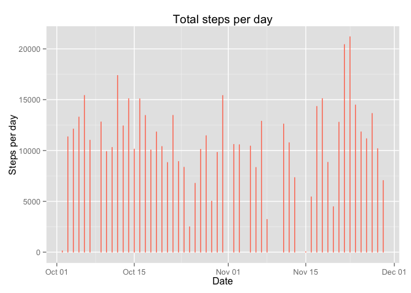
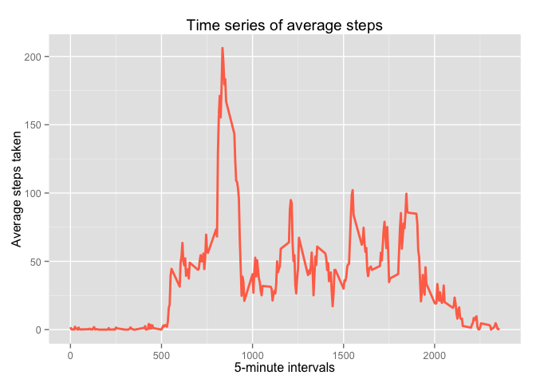
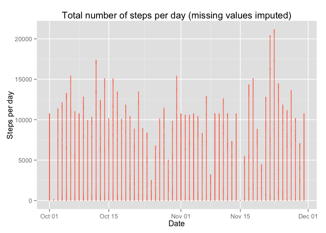
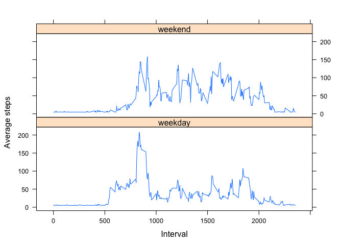

# Reproducible Research: Peer Assessment 1
### Lesley Lathrop  

## Global settings

```r
# Make output visible and turn of scientific notation for numbers
echo = TRUE
options(scipen = 1)
```

## Loading and preprocessing the data  

```r
actData <- read.csv("activity.csv", header = TRUE)
actData$date <- as.Date(actData$date, format = "%Y-%m-%d")
actData$steps <- as.numeric(actData$steps)
```

## What is mean total number of steps taken per day? 
  
*Calculate the total number of steps taken per day.*

```r
stepsDay <- aggregate(actData$steps, list(Date = actData$date),
                      FUN = "sum")
```
  
*Make a histogram of the total number of steps taken each day.*

```r
# Load ggplot
library(ggplot2)
stepsDay$x <- as.numeric(stepsDay$x)
g <- ggplot(stepsDay, aes(Date, x))
g <- g + geom_histogram(stat = "identity", colour = "coral1",
                  fill = "coral1", width = 0)
g <- g + labs(title = "Total steps per day",
                  y = "Steps per day")
g
```

```
## Warning: Removed 8 rows containing missing values (position_stack).
```

 
  
*Calculate and report the mean and median of steps per day.*

```r
mean(stepsDay$x, na.rm = TRUE)
```

```
## [1] 10766.19
```

```r
median(stepsDay$x, na.rm = TRUE)
```

```
## [1] 10765
```
  
## What is the average daily activity pattern?  
  
*Make a time series plot of the 5-minute interval and the average number of steps taken, averaged across all days.*

```r
avSteps <- aggregate(actData$steps, 
                     list(interval = actData$interval),
                     FUN = "mean", na.rm = TRUE)
names(avSteps)[2] <- "StepMean"
g2 <- ggplot(avSteps, aes(interval, StepMean))
g2 <- g2 + geom_line(colour = "coral1", lwd = 1) +
        labs(title = "Time series of average steps",
             x = "5-minute intervals", y = "Average steps taken")
g2
```

 
  
*Which 5-minute interval acontains the maximum number of steps?*

```r
avSteps[avSteps$StepMean == max(avSteps$StepMean),]
```

```
##     interval StepMean
## 104      835 206.1698
```

## Imputing missing values 
  
*Calculate and report the total number of missing values in the dataset.*  

```r
sum(is.na(actData))
```

```
## [1] 2304
```
  
*Devise a strategy for filling in all of the missing values in the dataset. Then create a new dataset equal to the original but with missing data filled in.*

```r
# Simple random imputation based on observed data
newActData <- actData
newActData <- transform(newActData, steps = ifelse(is.na(steps),
                        mean(steps, na.rm = TRUE), steps))
```
  
*Make a histogram of the total number of steps taken each day.*

```r
g3 <- ggplot(newActData, aes(date, steps))
g3 <- g3 + geom_histogram(stat = "identity", colour = "coral1",
                  fill = "coral1", width = 0)
g3 <- g3 + labs(title = "Total number of steps per day (missing values imputed)",
                  y = "Steps per day",
                  x = "Date")
g3
```

 
  
*Calculate and report the mean and median total number of steps taken per day.*

```r
newStepsDay <- aggregate(newActData$steps, 
                         list(Date = newActData$date), 
                         FUN = "sum")
mean(newStepsDay$x) 
```

```
## [1] 10766.19
```

```r
median(newStepsDay$x)
```

```
## [1] 10766.19
```
  
*Do these values differ from non-imputed data and what is the impact of imputing missing data on the estimates of the total daily number of steps?*

```r
mean(newStepsDay$x) - mean(stepsDay$x, na.rm = TRUE)
```

```
## [1] 0
```

```r
median(newStepsDay$x) - median(stepsDay$x, na.rm = TRUE)
```

```
## [1] 1.188679
```
The mean number of steps per day remains the same, while the median for the imputed data is slightly greater. Thus, there appears to be only a marginal difference when imputing the mean into the missing values.    

## Are there differences in activity patterns between weekdays and weekends? 
  
*Create a new factor variable in the dataset with two levels—"weekday" and "weekend." Then make a panel plot containing a time series of the 5-minute interval and the average number of steps taken, averaged across all weekday days or weekend days.*  

```r
newActData$weekday <- as.factor(weekdays(newActData$date))
levels(newActData$weekday) <- list(weekday = c("Monday",
                                               "Tuesday", 
                                               "Wednesday",
                                               "Thursday",
                                               "Friday"),
                                   weekend = c("Saturday",
                                               "Sunday"))

avgSteps <- aggregate(newActData$steps, 
                     list(interval = actData$interval,
                          weekdays = newActData$weekday),
                     FUN = "mean")
names(avgSteps)[3] <- "StepMean"
library(lattice)
xyplot(avgSteps$StepMean ~ avgSteps$interval | avgSteps$weekdays,
       layout = c(1,2), type = "l", colour = "coral1",
       xlab = "Interval", ylab = "Average steps")
```

 

